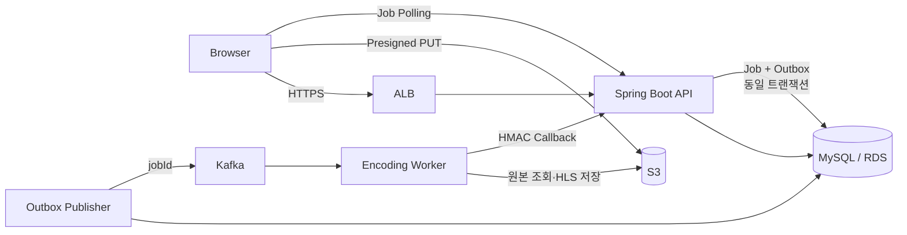

# OnFilm

배우가 프로필·필모그래피·스토리보드를 관리하고 영화와 트레일러를 HLS로 제공할 수 있는 독립영화 스트리밍 플랫폼 백엔드입니다.

개인 프로젝트로 AWS 인프라, JWT 인증, JPA 도메인 모델링, Kafka 기반 비동기 미디어 처리와 장애 대응을 구현했습니다.

- 초기 개발: 2024.07 ~ 2025.03
- 안정성·구조 개선: 2026.03, 2026.08
- Repository: [github.com/wonhoeh/onfilm](https://github.com/wonhoeh/onfilm)

## 핵심 기술 성과

- **JPA 조회 최적화**: Storyboard 조회 쿼리 수를 24회에서 3회로 줄이고 p95 응답 시간을 55.02ms에서 32.7ms로 개선
- **인덱스 최적화**: `movie_person.person_id` 조회의 스캔 행 수를 50,020행에서 20행으로 줄이고 max 응답 시간을 45% 개선
- **메시지 발행 신뢰성**: DB 저장과 Kafka 발행 사이의 유실을 방지하도록 Transactional Outbox와 lease·지수 백오프 재시도 구현
- **비동기 멱등성**: `requestId` 기반 업로드 요청과 `jobId` 기반 Worker 처리를 분리하여 중복 요청과 at-least-once 전달 대응
- **토큰 보안**: Refresh Token Rotation, 낙관적 락, 폐기 토큰 재사용 감지와 사용자 단위 세션 폐기 적용
- **도메인 캡슐화**: Aggregate Root가 자식 생성·연결·삭제·재정렬을 책임지도록 엔티티 불변식 통합
- **서비스 책임 분리**: Person, Gallery, Filmography, Movie를 Command·Query·Media 서비스로 나누고 소유권 검증을 서비스 계층에 통합

상세한 문제, 선택한 해결 방법과 트레이드오프는 [문제 해결 사례 기록](docs/problem-solving/README.md)에 정리했습니다.

## 주요 기능

| 영역 | 기능 |
|---|---|
| 인증 | JWT Access Token, DB 기반 Refresh Token Rotation, CSRF 방어, HttpOnly 쿠키 |
| 프로필 | 배우 기본 정보, 프로필 태그, SNS, 갤러리 순서 및 공개 범위 관리 |
| 필모그래피 | 참여 영화와 역할·배역·정렬 순서·개별 공개 범위 관리 |
| 스토리보드 | 프로젝트·Scene·Card 생성, 교체, 삭제와 순서 관리 |
| 영화 메타데이터 | Movie–Person 참여 관계, 표준·사용자 Genre, Trailer 관리 |
| 미디어 | S3 presigned URL 업로드, Kafka 비동기 인코딩, HLS 결과 반영 |
| 작업 추적 | 인코딩 Job 상태 조회, timeout과 보존 기간 관리 |

## 기술 스택

| 구분 | 기술 |
|---|---|
| Language | Java 17 |
| Framework | Spring Boot 3.3, Spring MVC, Spring Security |
| Persistence | Spring Data JPA, QueryDSL, MySQL, H2 |
| Messaging | Apache Kafka, Transactional Outbox |
| Storage | AWS S3, Local Storage |
| Infrastructure | AWS EC2, RDS, S3, ALB, VPC, NAT Gateway, CodeDeploy |
| CI/CD | GitHub Actions, AWS CodeDeploy |
| Test·Analysis | JUnit 5, Mockito, p6spy, k6, MySQL EXPLAIN |

## 시스템 아키텍처



운영 환경에서는 ALB만 외부 인바운드를 받고 API 서버, Encoding Worker와 RDS는 Private Subnet에 배치하는 구조로 설계했습니다.

## 미디어 업로드와 인코딩 흐름

1. 클라이언트가 Movie 편집 권한 검증 후 presigned URL을 요청합니다.
2. 서버가 `requestId`와 소유권이 포함된 raw `sourceKey`를 발급하고 `MediaUploadRequest`를 저장합니다.
3. 클라이언트가 원본 파일을 S3에 직접 업로드합니다.
4. 클라이언트가 같은 `requestId`, `sourceKey`, `contentType`으로 완료 API를 호출합니다.
5. 서버가 업로드 요청을 잠금 조회하고 `MediaEncodeJob`과 `MediaEncodeOutbox`를 같은 트랜잭션에 저장합니다.
6. Outbox Publisher가 커밋된 요청을 선점하여 Kafka에 발행합니다.
7. Worker가 원본을 가져와 ffmpeg로 HLS 또는 썸네일을 생성하고 S3에 저장합니다.
8. Worker가 timestamp·nonce·본문 해시 기반 HMAC 서명과 함께 내부 callback을 보냅니다.
9. 서버가 결과 파일과 예상 key를 검증하고 Movie 반영과 Job 완료를 같은 트랜잭션에서 처리합니다.
10. 클라이언트는 `GET /api/media-jobs/{jobId}`를 polling하여 완료 여부를 확인합니다.

Outbox 전달 보장은 at-least-once입니다. Kafka 발행과 Outbox 상태 저장 사이의 장애로 중복 메시지가 발생할 수 있으므로 Worker는 `jobId`를 멱등성 키로 사용합니다.

## 핵심 모델링 의사결정

### User와 Person 분리

`User`는 이메일·사용자명·인코딩된 비밀번호와 인증 생명주기를 담당하고, `Person`은 외부에 공개되는 프로필을 담당합니다. 인증 정책과 프로필 편집의 변경 이유를 분리하면서 `Person.publicId`를 외부 식별자로 사용해 내부 PK 노출을 피했습니다.

### 속성을 가진 관계는 조인 엔티티로 모델링

Movie와 Person의 관계에는 역할, 배역, 정렬 순서와 공개 범위가 필요하므로 `@ManyToMany` 대신 `MoviePerson`을 사용합니다. Movie와 Genre도 표준 Genre 참조와 사용자 입력·정규화 값을 함께 관리하기 위해 `MovieGenre`로 모델링했습니다.

### Aggregate Root가 자식 생명주기 관리

부모 엔티티의 `add*`, `remove*`, `replace*`, `reorder*`를 통해서만 자식 컬렉션을 변경합니다. 자식의 팩토리와 `attach*`·`detach*`는 외부에 노출하지 않고, 부모가 중복 검증과 양방향 연관관계 동기화를 완료합니다.

### 비동기 작업은 스냅샷으로 저장

`MediaEncodeJob`과 `RefreshToken`은 현재 Movie나 User 객체 탐색보다 작업·보안 이벤트의 상태 추적이 중요합니다. 관련 ID를 값으로 저장하여 대상 엔티티의 삭제와 무관하게 이력과 상태 머신을 유지합니다.

## JPA와 서비스 설계 원칙

- 연관관계는 기본적으로 LAZY 로딩을 사용하고 필요한 조회에서 fetch join 또는 IN 조회를 선택합니다.
- N:M 관계는 직접 매핑하지 않고 관계 속성과 제약을 관리할 수 있는 조인 엔티티로 풉니다.
- `cascade = ALL`과 `orphanRemoval = true`는 부모와 생명주기를 완전히 공유하는 자식에만 적용합니다.
- 엔티티 컬렉션은 읽기 전용으로 노출하고 상태 변경은 의미 있는 도메인 메서드로 제한합니다.
- Query 서비스는 `@Transactional(readOnly = true)`, Command 서비스는 쓰기 트랜잭션을 사용합니다.
- DTO는 record를 기본으로 하며 요청 형식, 유스케이스 조건, 도메인 불변식, DB 무결성의 검증 책임을 분리합니다.
- 내부 저장 값은 공개 URL 대신 storage key로 통일하고 응답 경계에서 URL로 변환합니다.
- 기존 파일 삭제는 DB 트랜잭션 커밋 이후 이벤트로 실행하고 신규 파일 실패에는 보상 삭제를 적용합니다.

## 성능 개선

### Storyboard N+1 제거

`Person → StoryboardProject → StoryboardScene`을 반복 탐색하며 발생하던 N+1을 fetch join과 `DISTINCT`로 개선했습니다.

측정 조건: VU 50, 4분, EC2 t2.micro + RDS t3.micro, Project 20개 × Scene 10개

| 지표 | 개선 전 | 개선 후 | 변화 |
|---|---:|---:|---:|
| 쿼리 수/요청 | 24회 | 3회 | -87% |
| p95 | 55.02ms | 32.7ms | -41% |
| p90 | 44.56ms | 28.16ms | -37% |
| 평균 | 35.31ms | 21.1ms | -40% |

### Filmography 인덱스 적용

`WHERE person_id = ?` 조회를 EXPLAIN으로 분석하고 `movie_person(person_id)` 인덱스를 적용했습니다.

측정 데이터: Person 500명, Movie 5,000개, MoviePerson 50,000행

| 지표 | 개선 전 | 개선 후 | 변화 |
|---|---:|---:|---:|
| 스캔 행 수/요청 | 50,020행 | 20행 | -99.96% |
| max | 254.89ms | 140.01ms | -45% |
| p95 | 29.79ms | 23.03ms | -23% |
| 평균 | 20.55ms | 17.8ms | -13% |

상세 측정 결과는 [k6 테스트 문서](docs/review/k6/)에서 확인할 수 있습니다.

## 인증과 보안

- 로그인 시 Access Token과 Refresh Token을 HttpOnly 쿠키로 발급하고 CSRF 토큰은 읽을 수 있는 별도 쿠키로 제공합니다.
- API 클라이언트를 위해 `Authorization: Bearer <token>`도 지원하며 Bearer 헤더를 쿠키보다 우선합니다.
- Refresh Token은 원문이 아닌 SHA-256 해시로 저장하고 회전 시 기존 토큰을 폐기합니다.
- 낙관적 락으로 같은 Refresh Token의 동시 회전을 감지합니다.
- 폐기 토큰 재사용은 탈취 의심 이벤트로 보고 해당 사용자의 전체 Refresh Token을 제거합니다.
- 만료 토큰 접근 기록은 `REQUIRES_NEW` 트랜잭션으로 보존한 뒤 공통 401을 반환합니다.
- 내부 Worker callback은 HMAC-SHA256, timestamp 허용 범위와 nonce 재사용 검증을 통과해야 합니다.
- 토큰 원문과 토큰 해시는 로그에 기록하지 않습니다.

## 로컬 실행

### 요구 사항

- Java 17
- Gradle Wrapper
- 비동기 인코딩 흐름 실행 시 Kafka broker (`localhost:9092`)

### 실행

개발 환경의 파일 저장 경로를 프로젝트 내부로 덮어써 실행합니다.

```bash
./gradlew bootRun --args='--spring.profiles.active=dev --file.storage.root=./local-storage'
```

개발 프로파일 기본값:

- DB: H2 in-memory, MySQL 호환 모드
- 파일: Local Storage
- 공개 파일 URL: `http://localhost:8080/files/{storageKey}`
- Kafka: `localhost:9092`
- H2 Console: `/h2-console`

테스트 실행:

```bash
./gradlew test
```

2026-08-24 서비스 책임 분리 리팩토링 완료 시점 기준 전체 자동화 테스트 190개가 통과했습니다.

## 운영 환경 변수

| 변수 | 설명 |
|---|---|
| `DB_URL`, `DB_USER`, `DB_PASSWORD` | MySQL 접속 정보 |
| `JWT_SECRET` | JWT 서명 비밀키 |
| `KAFKA_PRODUCER_IP` | Kafka broker 호스트 |
| `S3_BUCKET`, `S3_REGION` | S3 버킷과 리전 |
| `S3_ACCESS_KEY`, `S3_SECRET_KEY` | S3 자격 증명 |
| `S3_PUBLIC_BASE_URL` | 공개 파일 base URL |
| `MEDIA_ENCODE_CALLBACK_SECRET` | Worker callback HMAC 비밀키 |
| `AUTH_ACCESS_COOKIE_SECURE` | HTTPS 환경의 Access Cookie Secure 설정 |
| `AUTH_CSRF_COOKIE_SECURE` | HTTPS 환경의 CSRF Cookie Secure 설정 |
| `AUTH_REFRESH_COOKIE_SECURE` | HTTPS 환경의 Refresh Cookie Secure 설정 |

운영에서는 비밀값을 저장소에 기록하지 않고 배포 환경의 Secret으로 주입해야 하며, HTTPS 환경에서는 세 Cookie Secure 설정을 `true`로 사용해야 합니다.

## 문서

### 문제 해결과 기술 선택

- [문제 해결 사례 인덱스](docs/problem-solving/README.md)
- [도메인 예외와 API 오류 응답 표준화](docs/problem-solving/08-domain-exception-and-api-error-standardization.md)
- [Transactional Outbox 정책](docs/decisions/media-encode-job-outbox-policy.md)
- [Refresh Token 재사용 대응 정책](docs/decisions/refresh-token-reuse-policy.md)
- [Trailer storage key 정책](docs/decisions/trailer-storage-key-policy.md)

### 개발 컨벤션

- [엔티티 리팩토링 스타일](docs/convention/entity-refactoring-style-guide.md)
- [엔티티 메서드 네이밍](docs/convention/entity-method-naming-convention.md)
- [DTO 스타일](docs/convention/dto-style-convention.md)
- [검증 흐름](docs/convention/validation-flow-convention.md)
- [예외 정책과 오류 코드](docs/convention/exception-and-error-code-convention.md)

### 구현과 검증 자료

- [Service 단일 책임 지도](docs/review/service/service-responsibility-map.md)
- [Transaction Boundary 설계 가이드](docs/review/transaction/transaction-boundary-guide.md)
- [Domain Validation 위치 결정 가이드](docs/review/validation/domain-validation-location-guide.md)
- [트랜잭션 경계 감사](docs/review/transaction/transaction-boundary-audit.md)
- [내부 미디어 Callback API](docs/internal-media-callback-api.md)
- [로컬 Producer·Consumer 실행](docs/local-producer-consumer-setup.md)
- [k6 테스트 계획과 결과](docs/review/k6/)
- [JWT·CSRF 리뷰](docs/review/jwt/)
- [ERD](docs/images/onfilm-erd.png)

## 현재 범위와 후속 검토

- Worker nonce 저장소는 현재 프로세스 메모리 기반입니다. 다중 인스턴스에서는 Redis 또는 DB UNIQUE 제약을 통한 전역 replay 방지를 검토합니다.
- Outbox Publisher는 현재 polling 방식입니다. 처리량이 커지면 CDC 기반 relay를 검토합니다.
- 외부 Trailer URL 요구가 생기면 storage key와 외부 URL의 출처 유형을 명시적으로 분리할 예정입니다.
- MediaEncode 유지보수 서비스는 현재 복잡도가 낮아 추가 분리를 보류했습니다.
