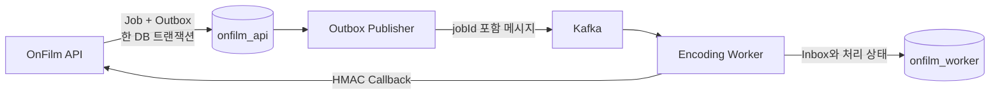

# API와 Worker의 DB 소유권 및 Flyway 초기화 정책

- 상태: Accepted
- 결정일: 2026-09-01
- 적용 대상: OnFilm API, OnFilm Encoding Worker, MySQL 개발·테스트·배포 환경

## 배경

OnFilm API와 Encoding Worker는 하나의 미디어 인코딩 흐름을 구성하지만 저장하는 데이터의 책임은 다르다.

- API는 사용자 요청, Movie 반영 상태, 인코딩 Job과 Kafka 발행 Outbox를 관리한다.
- Worker는 Kafka 메시지의 중복 처리 방지, 인코딩 진행 상태와 Callback 재시도를 위한 Inbox를 관리한다.

현재 API는 개발 환경에서 H2와 Hibernate `ddl-auto: create`, 배포 환경에서 MySQL과 `ddl-auto: create`를 사용한다. Worker는 개발 환경에서 H2와 `create-drop`, 기본 환경에서 `ddl-auto: update`를 사용한다. 따라서 현재 스키마는 애플리케이션 시작 시 Hibernate가 생성하거나 변경하며, 변경 이력과 적용 순서를 별도로 추적하지 않는다.

두 애플리케이션이 같은 DB와 계정을 공유하면 다음 문제가 생긴다.

- 어느 애플리케이션이 어떤 테이블을 변경할 수 있는지 경계가 불명확하다.
- API 배포가 Worker 테이블에, Worker 배포가 API 테이블에 영향을 줄 수 있다.
- 계정 하나가 노출되면 전체 데이터에 접근할 수 있다.
- Flyway를 도입할 때 두 저장소의 Migration 버전과 배포 순서가 충돌할 수 있다.

반대로 초기 서비스 규모에서 MySQL 서버 자체를 두 개 운영하면 비용과 운영 복잡도가 커진다. 따라서 물리 서버는 공유하되 논리 DB와 계정을 서비스별로 분리한다.

## 결정

### 1. 물리 MySQL은 공유하고 논리 DB는 분리한다

초기 환경은 하나의 MySQL 서버 또는 RDS 인스턴스 안에 두 개의 논리 DB를 둔다.

```text
MySQL instance
├── onfilm_api
│   ├── API domain tables
│   └── flyway_schema_history
└── onfilm_worker
    ├── Worker inbox table
    └── flyway_schema_history
```

이 선택은 인프라 비용을 줄이면서 스키마 변경 권한과 데이터 소유권을 분리한다. 다만 CPU, 메모리, Connection, 스토리지와 장애 영역은 여전히 공유한다. Worker 부하가 API DB 응답에 영향을 주거나 서로 다른 가용성·확장 정책이 필요해지면 물리 인스턴스 분리를 다시 검토한다.

### 2. 애플리케이션 계정을 분리한다

기본 계정은 다음과 같다.

| 애플리케이션 | 논리 DB | 계정 | 접근 범위 |
|---|---|---|---|
| API | `onfilm_api` | `onfilm_api_app` | `onfilm_api.*`만 허용 |
| Worker | `onfilm_worker` | `onfilm_worker_app` | `onfilm_worker.*`만 허용 |

다음 접근은 허용하지 않는다.

- `onfilm_api_app`이 `onfilm_worker`의 테이블을 조회하거나 변경하는 행위
- `onfilm_worker_app`이 `onfilm_api`의 테이블을 조회하거나 변경하는 행위
- DB 사이의 Foreign Key, JOIN, View 또는 직접 SQL 조회
- 두 논리 DB에 걸친 애플리케이션 트랜잭션

초기 Flyway 도입에서는 서비스별 계정으로 자기 DB의 Migration을 실행할 수 있다. 공개 운영 단계에서 최소 권한을 더 강화할 때는 DDL 권한을 가진 배포용 Migration 계정과 DML만 허용하는 Runtime 계정을 분리한다. 이 후속 분리는 API와 Worker 사이의 계정 분리 원칙을 바꾸지 않는다.

비밀번호와 접속 문자열은 Git에 저장하지 않고 환경변수 또는 Secret 저장소로 주입한다.

### 3. 서비스가 자기 데이터와 Migration을 소유한다

API 저장소는 `onfilm_api`의 Flyway Migration만 관리하고, Worker 저장소는 `onfilm_worker`의 Flyway Migration만 관리한다. 두 저장소는 각각 자신의 `flyway_schema_history`를 가지므로 같은 버전 번호가 존재해도 충돌하지 않는다.

```text
onfilm API repository
└── src/main/resources/db/migration
    ├── V1__create_initial_schema.sql
    └── V2__...

onfilm-encoding-worker repository
└── src/main/resources/db/migration
    ├── V1__create_initial_schema.sql
    └── V2__...
```

API 배포는 API Migration만, Worker 배포는 Worker Migration만 실행한다. 한 저장소에서 다른 서비스의 Migration 파일을 추가하거나 수정하지 않는다.

## 현재 테이블 소유권

현재 JPA 모델을 기준으로 한 소유권은 다음과 같다. 정확한 컬럼 타입, 이름, 제약조건과 인덱스는 각 서비스의 `V1` 작성 단계에서 Hibernate 생성 결과와 엔티티 매핑을 대조해 확정한다.

### API: `onfilm_api`

| 영역 | 소유 테이블 또는 값 컬렉션 |
|---|---|
| 사용자·프로필 | `users`, `person`, `person_sns`, `profile_tag`, `person_gallery` |
| 영화·참여 관계 | `movie`, `movie_person`, `movie_person_role`, `genre`, `movie_genre`, `trailer`, Movie likes 값 컬렉션 |
| 스토리보드 | `storyboard_project`, `storyboard_scene`, `storyboard_card` |
| 인증 | `refresh_tokens` |
| 미디어 요청·발행 | `media_upload_requests`, `media_encode_jobs`, `media_encode_outbox` |

`MediaEncodeJob.movieId`, `requestedByUserId`처럼 ID 값만 저장하는 약한 관계의 FK 적용 여부는 Constraint 감사 단계에서 결정한다. 이 값들이 Worker DB를 참조하는 것은 아니다.

### Worker: `onfilm_worker`

| 영역 | 소유 테이블 |
|---|---|
| 메시지 수신·인코딩 상태 | `media_encode_inbox` |

Worker의 `media_encode_inbox.job_id`는 API의 `media_encode_jobs.id`와 같은 값을 사용하지만 DB Foreign Key가 아니다. `jobId`는 Kafka 메시지와 Callback API에서 사용하는 상관관계·멱등성 식별자다.

## 서비스 사이의 데이터 흐름



- API의 Job과 Outbox 원자성은 `onfilm_api` 내부의 한 로컬 트랜잭션으로 보장한다.
- Worker의 메시지 선점과 Inbox 상태 변경은 `onfilm_worker` 내부 트랜잭션으로 보장한다.
- Kafka 전달은 at-least-once이므로 Worker는 `jobId`를 Inbox PK로 사용해 중복 처리를 막는다.
- Worker 결과는 API Callback을 통해 반영하며 API DB를 직접 갱신하지 않는다.
- 두 DB를 하나의 분산 트랜잭션으로 묶지 않고 Outbox, Inbox, 멱등성과 상태 전이로 최종 일관성을 확보한다.

## Flyway 초기 Schema 전략

### 운영 데이터가 없는 빈 DB에서 V1을 시작한다

현재 서비스에는 보존하거나 변환해야 할 운영 데이터가 없다. 기존 Hibernate 생성 스키마에 Flyway의 `baseline` 명령을 적용하지 않고, 빈 DB에 전체 스키마를 생성하는 `V1__create_initial_schema.sql`을 서비스별로 작성한다.

여기서 말하는 `V1`은 최초 Versioned Migration이다. 기존 스키마를 이력에 등록만 하는 Flyway `baseline` 또는 `baselineOnMigrate` 기능은 사용하지 않는다.

전환 절차는 다음과 같다.

1. 현재 JPA 엔티티가 요구하는 테이블, 컬럼, 제약조건과 인덱스를 조사한다.
2. API와 Worker가 각각 자기 DB를 생성하는 `V1` SQL을 작성한다.
3. 빈 MySQL에 Flyway Migration을 실행한다.
4. Hibernate `ddl-auto: validate`로 엔티티와 DB 스키마가 일치하는지 확인한다.
5. Repository와 트랜잭션 통합 테스트를 MySQL Testcontainers에서 실행한다.
6. 검증이 끝난 뒤 `create`, `create-drop`, `update`를 애플리케이션 스키마 관리 방식에서 제거한다.

### 적용된 Migration은 수정하지 않는다

`V1`이 저장소에 병합되어 공유 환경에 한 번이라도 적용된 뒤에는 내용을 수정하지 않는다. 이후 변경은 순서가 증가하는 새 Migration으로 작성한다.

```text
V1__create_initial_schema.sql
V2__add_movie_person_constraints.sql
V3__add_media_outbox_dispatch_index.sql
```

두 저장소의 버전 번호는 서로 독립적이다. API의 `V3`과 Worker의 `V3`이 서로 같은 배포나 기능을 의미할 필요는 없다.

## Hibernate와 초기 데이터 정책

Flyway 전환 후 스키마의 단일 변경 주체는 SQL Migration이다.

- Hibernate: 엔티티와 스키마의 불일치를 탐지하는 `validate`만 수행
- Flyway: 테이블, 컬럼, Constraint와 Index 생성·변경
- 운영 Reference Data: 정책을 확정한 뒤 Flyway 또는 명시적인 초기화 방식으로 관리
- 개발·테스트 Fixture: 운영 Migration과 분리
- H2: 빠른 단위 테스트 보조 수단으로만 사용
- MySQL Testcontainers: Migration, Repository, Constraint, Transaction과 Lock 검증 기준

현재 `data.sql`과 개발 초기화 코드는 후속 Reference Data·Fixture 분리 단계에서 정리한다. 이 문서 작업에서는 실행 설정이나 데이터 초기화 코드를 변경하지 않는다.

## 환경변수 계약

기존 변수 이름을 유지하되 서로 다른 DB URL과 계정을 주입한다.

| 서비스 | URL | 사용자 | 비밀번호 |
|---|---|---|---|
| API | `DB_URL` | `DB_USER` | `DB_PASSWORD` |
| Worker | `WORKER_DB_URL` | `WORKER_DB_USER` | `WORKER_DB_PASSWORD` |

예시는 다음과 같다. 실제 비밀번호는 예제 값도 저장소 운영 설정에 재사용하지 않는다.

```text
DB_URL=jdbc:mysql://mysql:3306/onfilm_api
DB_USER=onfilm_api_app

WORKER_DB_URL=jdbc:mysql://mysql:3306/onfilm_worker
WORKER_DB_USER=onfilm_worker_app
```

## 배포 순서

서비스별 배포는 다음 순서를 지킨다.

1. 해당 서비스 계정으로 해당 논리 DB에만 연결되는지 확인한다.
2. 해당 저장소의 Flyway Migration을 실행한다.
3. Migration 실패 시 애플리케이션 시작을 중단한다.
4. Hibernate Schema Validation을 통과한 애플리케이션만 기동한다.
5. Health Check와 핵심 Repository 조회를 확인한다.

API와 Worker에 공통 메시지 필드가 추가되는 경우 DB를 공유하지 않고 메시지 스키마의 하위 호환성과 배포 순서를 별도로 설계한다.

## 기술 선택과 트레이드오프

### 선택한 방식의 장점

- MySQL 서버 한 대로 초기 인프라 비용을 유지한다.
- API와 Worker의 테이블 소유권, 변경 책임과 장애 조사 범위가 명확해진다.
- 계정이 노출되거나 잘못된 SQL이 실행돼도 다른 서비스 DB로 영향이 확산되는 것을 제한한다.
- Flyway 버전 충돌 없이 서비스별 배포가 가능하다.
- Worker가 API DB에 결합되지 않아 향후 별도 MySQL 인스턴스로 이동하기 쉽다.

### 감수하는 비용과 한계

- DB, 계정, 환경변수와 Flyway 이력을 각각 관리해야 한다.
- 같은 MySQL 서버의 CPU, Connection, 스토리지와 장애 영역은 공유한다.
- DB JOIN 대신 Kafka 메시지와 Callback 계약을 관리해야 한다.
- 서비스별 데이터의 원자적 변경은 불가능하므로 중복 전달과 부분 실패를 애플리케이션에서 처리해야 한다.
- 초기 계정이 Flyway와 Runtime 권한을 함께 가지면 최소 권한이 완전하지 않다. 공개 운영 전 Migration 계정 분리를 재검토한다.

## 검토했지만 선택하지 않은 대안

### 하나의 DB와 하나의 계정 공유

구성은 가장 단순하지만 서비스별 소유권과 권한 경계가 사라지고 두 저장소의 Migration 충돌 가능성이 있어 선택하지 않았다.

### MySQL 서버를 API와 Worker용으로 각각 운영

장애와 자원 경합까지 분리할 수 있지만 현재 1~2명 규모의 MVP에는 비용과 운영 부담이 크다. 논리 DB 분리로 시작하고 부하 또는 가용성 요구가 생기면 확장한다.

### 하나의 저장소에서 두 DB Migration 통합 관리

전체 버전을 한곳에서 볼 수 있지만 서비스가 독립적으로 배포되지 못하고 다른 저장소의 변경을 기다려야 한다. 각 서비스가 자기 스키마를 소유하도록 하기 위해 선택하지 않았다.

## 후속 구현 완료 기준

- 같은 MySQL 인스턴스에 `onfilm_api`, `onfilm_worker`가 생성된다.
- API와 Worker가 서로 다른 계정을 사용한다.
- 각 계정으로 상대 서비스 DB에 접근하면 권한 오류가 발생한다.
- 두 DB에 별도의 `flyway_schema_history`가 생성된다.
- API와 Worker가 각각 빈 MySQL에서 `V1` Migration을 성공한다.
- 두 애플리케이션 모두 Hibernate `validate`를 통과한다.
- MySQL Testcontainers와 CI가 Migration 및 주요 영속성 테스트를 실행한다.
- API와 Worker 사이에 DB FK, JOIN 또는 직접 Repository 접근이 없다.

## 후속 작업

1. API와 Worker 저장소의 `AGENTS.md`에 Database schema changes 규칙을 추가한다.
2. 한 MySQL 서버에 두 논리 DB와 계정을 만드는 로컬·테스트 구성을 추가한다.
3. API와 Worker에 MySQL Testcontainers 기반 통합 테스트 환경을 구축한다.
4. 각 서비스의 `V1__create_initial_schema.sql`과 Hibernate `validate` 설정을 적용한다.
5. 운영 Reference Data와 개발 Fixture를 분리한다.
6. Constraint, 동시성, 주요 SQL과 Index를 MySQL에서 검증한다.

## 관련 문서

- [Media encode job과 Transactional Outbox 정책](media-encode-job-outbox-policy.md)
- [미디어 장애 처리 정책](media-failure-handling-policy.md)
- [Movie 참여와 역할 모델링 정책](movie-person-role-modeling-policy.md)
- [Transaction Boundary 설계 가이드](../review/transaction/transaction-boundary-guide.md)
