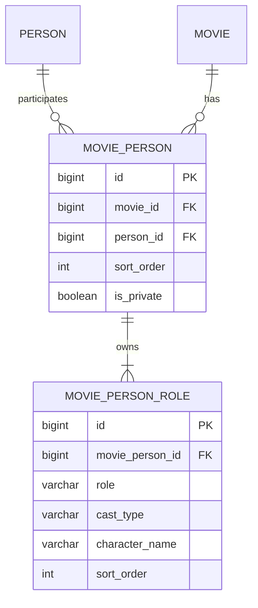

# Movie 참여와 역할을 분리해 모델링한다

- 상태: Accepted
- 결정일: 2026-08-31

## 배경

OnFilm은 Person의 직업을 하나로 고정하는 서비스가 아니다. 한 사람은 작품마다 배우, 감독, 작가 중 하나 이상의 역할로 참여할 수 있고, 같은 작품에서 감독과 작가 또는 배우 역할을 동시에 맡을 수도 있다.

기존 `MoviePerson`은 다음 정보를 한 행에 함께 저장했다.

```text
movie_id, person_id, role, cast_type, character_name, sort_order, is_private
```

이 구조에는 두 가지 문제가 있었다.

1. 서비스가 `(movie_id, person_id)`당 필모그래피 항목 하나를 전제로 조회·수정하지만, 역할을 여러 개 저장하려면 `MoviePerson` 행을 역할 수만큼 만들어야 했다.
2. 기존 Unique Constraint `(movie_id, person_id, role, cast_type, character_name)`에서 감독과 작가는 `cast_type`, `character_name`이 `NULL`이다. MySQL Unique Index는 `NULL`이 포함된 중복 행을 허용할 수 있어 같은 감독·작가 역할의 중복을 확실히 차단하지 못한다.

또한 역할별 행을 만들면 작품 공개 여부와 필모그래피 정렬 순서가 역할마다 중복되어, 같은 작품의 역할끼리 서로 다른 공개 상태와 순서를 가질 수 있었다.

## 결정

`MoviePerson`은 Person의 Movie 참여 자체를 표현하고, `MoviePersonRole`은 그 참여에서 담당한 역할을 표현한다.



한 작품에서 배우·감독·작가를 모두 맡았다면 `MoviePerson`은 하나, `MoviePersonRole`은 세 개가 된다.

```text
movie_person
id=25, movie_id=100, person_id=10, sort_order=0, is_private=false

movie_person_role
movie_person_id=25, role=ACTOR,    cast_type=LEAD, character_name=주인공
movie_person_id=25, role=DIRECTOR, cast_type=NULL, character_name=NULL
movie_person_id=25, role=WRITER,   cast_type=NULL, character_name=NULL
```

## 책임과 생명주기

### Movie

- 같은 Movie에 같은 Person이 두 번 참여하지 못하도록 검사한다.
- `MoviePerson` 생성과 Movie 양방향 연결을 완료한다.
- `(movie_id, person_id)`를 참여 관계의 식별 가능한 비즈니스 키로 사용한다.

### MoviePerson

- 작품 참여 단위의 `sortOrder`, `isPrivate`를 소유한다.
- `MoviePersonRole`의 생성·추가·삭제·교체와 양방향 관계를 관리한다.
- 역할 컬렉션을 읽기 전용으로 노출한다.
- 역할이 하나 이상 존재하고 같은 역할이 중복되지 않는다는 불변식을 지킨다.

### MoviePersonRole

- `role`, `castType`, `characterName`을 소유한다.
- `ACTOR`에는 `castType`을 필수로 요구한다.
- `DIRECTOR`, `WRITER`에는 배우 전용 필드를 허용하지 않는다.
- 역할 자체는 변경하지 않는다. 역할 변경은 기존 역할 제거와 새 역할 추가로 표현한다.

## 제약조건

초기 Flyway 스키마에는 다음 제약조건을 반영한다.

```sql
CONSTRAINT uk_movie_person_movie_id_person_id
    UNIQUE (movie_id, person_id)
```

```sql
CONSTRAINT uk_movie_person_role_participation_role
    UNIQUE (movie_person_id, role)
```

```sql
CONSTRAINT ck_movie_person_role_actor_fields
    CHECK (
        (role = 'ACTOR' AND cast_type IS NOT NULL)
        OR
        (
            role IN ('DIRECTOR', 'WRITER')
            AND cast_type IS NULL
            AND character_name IS NULL
        )
    )
```

현재 프로젝트는 아직 Flyway 도입 전이므로 동일한 제약을 JPA 매핑과 Hibernate `@Check`에 반영했다. Flyway 도입 후에는 SQL Migration이 실제 스키마의 단일 변경 주체가 되고 Hibernate는 `validate`만 수행한다.

## 역할 교체 정책

필모그래피 전체 수정 요청은 역할을 전부 삭제하고 다시 삽입하지 않는다.

```text
요청 전: ACTOR, DIRECTOR
요청 후: ACTOR, WRITER

ACTOR    → 기존 행 유지, 배우 상세 정보만 변경
DIRECTOR → orphanRemoval로 삭제
WRITER   → 새 행 추가
```

같은 역할의 엔티티 ID를 유지하면 불필요한 DELETE/INSERT를 줄이고 Unique Constraint와의 삽입 순서 충돌을 피할 수 있다.

## API 계약

단일 역할 필드 대신 역할 목록을 사용한다.

```json
{
  "roles": [
    {
      "role": "ACTOR",
      "castType": "LEAD",
      "characterName": "주인공"
    },
    {
      "role": "DIRECTOR",
      "castType": null,
      "characterName": null
    },
    {
      "role": "WRITER",
      "castType": null,
      "characterName": null
    }
  ]
}
```

DTO에서는 목록 필수·최대 3개·중복 역할·역할별 입력 조합을 검증하고, Entity가 같은 불변식을 다시 보장한다. 공개 조회 응답도 `roles[]`를 반환하며 편집 화면은 역할을 복수 선택할 수 있다.

## 기술 선택과 트레이드오프

### 선택한 구조의 장점

- 한 작품을 필모그래피 카드 하나로 유지하면서 여러 역할을 표현할 수 있다.
- 공개 여부와 정렬 순서가 역할 수만큼 중복되지 않는다.
- Nullable 컬럼이 포함된 복합 Unique Constraint 문제를 제거한다.
- 배우·감독·작가 경력을 역할 목록으로 집계하기 쉽다.
- 향후 역할별 상세 속성을 확장할 위치가 명확하다.

### 감수한 비용

- `movie_person_role` 테이블과 1:N 연관관계가 추가된다.
- 조회 시 역할 컬렉션을 함께 로딩해야 한다.
- Request·Response가 단일 역할에서 목록으로 변경되어 클라이언트 수정이 필요하다.
- 역할 교체 시 자식 컬렉션의 추가·유지·삭제를 동기화하는 로직이 필요하다.

현재 서비스는 운영 중이 아니며 보존해야 할 운영 데이터가 없어, 이전 API와 스키마의 하위 호환성보다 올바른 모델을 우선했다.

## 검토했지만 선택하지 않은 대안

### `UNIQUE(movie_id, person_id, role)`로 역할마다 MoviePerson 행 생성

구현은 단순하지만 `sortOrder`와 `isPrivate`가 역할마다 중복된다. 현재 서비스의 작품당 필모그래피 항목 하나라는 계약과도 충돌해 선택하지 않았다.

### `NULL` 대신 `NOT_APPLICABLE` 저장

Unique Index의 `NULL` 문제는 피할 수 있지만 실제 도메인 값이 아닌 가짜 `CastType`과 배역명을 저장해야 하므로 선택하지 않았다.

### 함수 인덱스에서 `COALESCE` 사용

MySQL 종속적인 인덱스로 중복만 막을 뿐 참여 정보와 역할 정보가 한 행에 섞인 모델링 문제를 해결하지 못한다.

### 배우와 제작진 테이블 분리

한 사람이 배우·감독·작가 역할을 넘나드는 서비스에서 통합 필모그래피 조회와 역할 집계가 복잡해지고 공통 관계 정보가 중복되어 선택하지 않았다.

## 검증

- Domain test: 복수 역할 생성, 빈 역할·중복 역할 거부, 배우 조건 검증, 읽기 전용 컬렉션
- Domain test: 역할 교체 시 기존 역할 유지, 제거 역할 양방향 해제
- Persistence test: 한 참여와 역할 3개 저장·조회
- Persistence test: 역할 교체 시 기존 역할 ID 유지와 제거 역할 orphan 삭제
- DTO test: 복수 역할 허용, 빈 목록·중복·잘못된 배우 입력 거부
- Service test: 생성·수정·조회에서 다중 역할 전달
- Frontend: 편집 화면 복수 선택과 공개 카드 역할 표시, JavaScript 문법 검사
- Regression: `./gradlew check` 성공

## 후속 작업

- Flyway 초기 스키마에 두 Unique Constraint, Check Constraint와 Foreign Key를 명시한다.
- Testcontainers MySQL에서 Nullable·Unique·Check Constraint와 동시 등록 경쟁 조건을 검증한다.
- 필모그래피 조회 SQL을 기준으로 `movie_person(person_id, sort_order, id)` 및 역할 조회 인덱스를 EXPLAIN 후 결정한다.
- 한 배우가 같은 작품에서 복수 배역을 맡는 요구가 생기면 `ACTOR` 역할 아래 별도 배역 엔티티를 두는 방안을 검토한다.
- 영상 이용 권한은 MVP 동안 수동으로 확인하고, 공개 서비스 전환 시 [Movie 영상 이용 권한 MVP 정책](movie-media-rights-mvp-policy.md)에 따라 전자서명과 권리 상태 모델을 검토한다.
