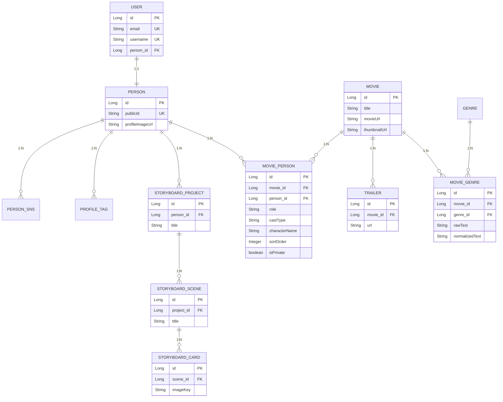

# 엔티티 연관관계 정리

## 면접 30초 답변 버전

이 프로젝트는 `User - Person - Movie`를 중심으로 관계를 설계했고, 배우와 작품의 관계는 단순 다대다가 아니라 `MoviePerson` 매핑 엔티티로 풀었습니다. 이렇게 한 이유는 단순 연결뿐 아니라 역할, 배역명, 공개 여부, 정렬 순서 같은 속성을 함께 관리해야 했기 때문입니다. 미디어 인코딩 작업은 `MediaEncodeJob`으로 별도 관리하지만, 이쪽은 JPA 연관관계보다 작업 스냅샷 중심으로 `movieId`, `requestedByUserId`를 저장하는 구조를 택했습니다.

---

## 1. 전체 관계도

---

## 2. 핵심 엔티티별 관계 표

| 엔티티 | 연관 대상 | 관계 | 비고 |
|---|---|---|---|
| `User` | `Person` | 1:1 | 회원 계정과 프로필 연결 |
| `Person` | `PersonSns` | 1:N | SNS 링크 목록 |
| `Person` | `ProfileTag` | 1:N | 프로필 태그 |
| `Person` | `StoryboardProject` | 1:N | 스토리보드 프로젝트 |
| `Person` | `MoviePerson` | 1:N | 필모그래피 매핑 |
| `Movie` | `MoviePerson` | 1:N | 작품 참여자 매핑 |
| `Movie` | `Trailer` | 1:N | 트레일러 여러 개 가능 |
| `Movie` | `MovieGenre` | 1:N | 장르 매핑 |
| `MovieGenre` | `Genre` | N:1 | 표준 장르 연결 가능 |
| `StoryboardProject` | `StoryboardScene` | 1:N | 장면 목록 |
| `StoryboardScene` | `StoryboardCard` | 1:N | 컷/이미지 카드 목록 |

---

## 3. 도메인별 해석

### 3-1. 계정과 프로필

- `User`는 로그인/인증 중심 엔티티
- `Person`은 배우 프로필 중심 엔티티
- 둘은 1:1 관계

즉 서비스 관점에서는 “회원 계정”과 “공개 프로필”을 분리한 구조다.

관련 코드:

- [`User.java`](/Users/whheo/Desktop/onfilm/onfilm/src/main/java/com/onfilm/domain/user/entity/User.java)
- [`Person.java`](/Users/whheo/Desktop/onfilm/onfilm/src/main/java/com/onfilm/domain/movie/entity/Person.java)

### 3-2. 필모그래피

- `Person`과 `Movie`는 직접 다대다로 연결하지 않음
- 중간에 `MoviePerson`을 둠

이 구조 덕분에 아래 속성을 관계 자체에 저장할 수 있다.

- `role`
- `castType`
- `characterName`
- `sortOrder`
- `isPrivate`

즉 “배우가 어떤 작품에 참여했다”는 사실만 저장하는 게 아니라, “어떤 역할로, 어떤 배역명으로, 어떤 순서로, 공개 여부는 어떤지”까지 관리할 수 있다.

관련 코드:

- [`Movie.java`](/Users/whheo/Desktop/onfilm/onfilm/src/main/java/com/onfilm/domain/movie/entity/Movie.java)
- [`MoviePerson.java`](/Users/whheo/Desktop/onfilm/onfilm/src/main/java/com/onfilm/domain/movie/entity/MoviePerson.java)

### 3-3. 작품 미디어

- `Movie`는 본편 영상 경로 `movieUrl`, 썸네일 경로 `thumbnailUrl`을 직접 가짐
- 트레일러는 `Trailer` 엔티티로 분리해 1:N 구조

이 말은 곧:

- 본편 영상은 대표값 1개
- 트레일러는 여러 개 가능

라는 도메인 의도가 반영된 설계다.

관련 코드:

- [`Movie.java`](/Users/whheo/Desktop/onfilm/onfilm/src/main/java/com/onfilm/domain/movie/entity/Movie.java)
- [`Trailer.java`](/Users/whheo/Desktop/onfilm/onfilm/src/main/java/com/onfilm/domain/movie/entity/Trailer.java)

### 3-4. 장르

- `MovieGenre`는 `Movie`와 `Genre` 사이의 연결 엔티티 역할
- 동시에 `rawText`, `normalizedText`도 보관

즉 장르는 단순 FK 연결만이 아니라:

- 사용자가 입력한 원문
- 검색/중복 제거용 정규화 텍스트
- 표준 장르 매핑 결과

를 함께 관리하는 구조다.

관련 코드:

- [`MovieGenre.java`](/Users/whheo/Desktop/onfilm/onfilm/src/main/java/com/onfilm/domain/movie/entity/MovieGenre.java)
- [`Genre.java`](/Users/whheo/Desktop/onfilm/onfilm/src/main/java/com/onfilm/domain/genre/entity/Genre.java)

### 3-5. 스토리보드

스토리보드는 다음 계층으로 구성된다.

- `Person`
- `StoryboardProject`
- `StoryboardScene`
- `StoryboardCard`

즉 한 사람이 여러 프로젝트를 갖고, 각 프로젝트는 여러 장면을 가지며, 각 장면은 여러 카드 이미지를 가진다.

관련 코드:

- [`StoryboardProject.java`](/Users/whheo/Desktop/onfilm/onfilm/src/main/java/com/onfilm/domain/movie/entity/StoryboardProject.java)
- [`StoryboardScene.java`](/Users/whheo/Desktop/onfilm/onfilm/src/main/java/com/onfilm/domain/movie/entity/StoryboardScene.java)
- [`StoryboardCard.java`](/Users/whheo/Desktop/onfilm/onfilm/src/main/java/com/onfilm/domain/movie/entity/StoryboardCard.java)

---

## 4. 왜 `MoviePerson` 같은 매핑 엔티티를 두었는가

### 4-1. 단순 다대다로는 부족했기 때문

`Person`과 `Movie`를 JPA `@ManyToMany`로 단순 연결하면, “이 사람이 이 영화에 참여했다” 정도는 표현할 수 있다.  
하지만 이 프로젝트에서는 관계 자체가 아래 속성을 가져야 했다.

- 배우/감독/작가 같은 `role`
- 주연/조연/단역 같은 `castType`
- 배우일 때의 `characterName`
- 필모그래피 표시 순서인 `sortOrder`
- 프로필 공개 여부인 `isPrivate`

즉 이 관계는 단순 연결이 아니라 “속성을 가진 관계”이기 때문에, 별도 엔티티로 분리하는 것이 맞다.

### 4-2. 필모그래피 도메인의 중심이 관계 자체이기 때문

이 프로젝트에서 사용자가 편집하는 것은 영화 자체만이 아니다.  
실제로는 “내 프로필에서 이 영화를 어떤 순서로, 어떤 역할로 보여줄지”를 편집한다.

즉 필모그래피는 `Movie` 단독 엔티티보다 `Person - Movie 관계`가 더 중요하다.  
그래서 `MoviePerson`이 필모그래피 도메인의 핵심 엔티티 역할을 한다.

### 4-3. 무결성 제약도 걸기 쉽기 때문

현재 `MoviePerson`에는 아래 unique constraint가 있다.

- `movie_id`
- `person_id`
- `role`
- `cast_type`
- `character_name`

즉 동일한 조합의 참여 관계가 중복 생성되지 않도록 DB 레벨에서도 통제할 수 있다.

관련 코드:

- [`MoviePerson.java`](/Users/whheo/Desktop/onfilm/onfilm/src/main/java/com/onfilm/domain/movie/entity/MoviePerson.java#L11)

### 4-4. 면접에서 이렇게 말하면 된다

`배우와 영화는 겉으로 보면 다대다 관계처럼 보이지만, 실제 서비스에서는 역할, 배역명, 공개 여부, 정렬 순서 같은 속성이 관계 자체에 붙어야 했습니다. 그래서 JPA의 단순 ManyToMany 대신 MoviePerson이라는 매핑 엔티티를 두고, 필모그래피 도메인을 관계 중심으로 설계했습니다.`

---

## 5. JPA 연관관계로 묶지 않은 데이터

모든 FK 성격의 데이터가 JPA 연관관계인 것은 아니다.

### 5-1. `RefreshToken`

- `userId` 값만 저장
- `User` 엔티티와 `@ManyToOne`으로 묶지 않음

이 구조는 토큰 도메인을 인증 처리 중심으로 단순하게 유지하는 데 유리하다.

관련 코드:

- [`RefreshToken.java`](/Users/whheo/Desktop/onfilm/onfilm/src/main/java/com/onfilm/domain/token/entity/RefreshToken.java)

### 5-2. `MediaEncodeJob`

- `movieId`
- `requestedByUserId`

를 컬럼으로만 저장하고, `Movie`, `User`와 직접 JPA 연관을 맺지 않는다.

이 엔티티는 “현재 도메인 객체를 탐색하기 위한 관계”보다 “작업 스냅샷과 상태 추적”이 목적이기 때문이다.

즉 다음 정보가 더 중요하다.

- 어떤 작업인지
- 어떤 원본/결과 경로인지
- 상태가 REQUESTED/PROCESSING/DONE/FAILED 중 무엇인지
- 언제 시작/종료/실패했는지

관련 코드:

- [`MediaEncodeJob.java`](/Users/whheo/Desktop/onfilm/onfilm/src/main/java/com/onfilm/domain/kafka/entity/MediaEncodeJob.java)

### 5-3. 면접에서 이렇게 말하면 된다

`모든 외래키 성격의 값을 JPA 연관관계로 묶지는 않았습니다. 예를 들어 MediaEncodeJob은 Movie와 User를 직접 참조하기보다, 작업 당시의 movieId, requestedByUserId, sourceKey, targetKey를 스냅샷처럼 저장하는 구조를 택했습니다. 작업 이력과 비동기 상태 추적이 목적이었기 때문에 오히려 이 방식이 더 단순하고 명확하다고 판단했습니다.`

---

## 6. 코드 기준 핵심 파일

- [`Person.java`](/Users/whheo/Desktop/onfilm/onfilm/src/main/java/com/onfilm/domain/movie/entity/Person.java)
- [`User.java`](/Users/whheo/Desktop/onfilm/onfilm/src/main/java/com/onfilm/domain/user/entity/User.java)
- [`Movie.java`](/Users/whheo/Desktop/onfilm/onfilm/src/main/java/com/onfilm/domain/movie/entity/Movie.java)
- [`MoviePerson.java`](/Users/whheo/Desktop/onfilm/onfilm/src/main/java/com/onfilm/domain/movie/entity/MoviePerson.java)
- [`Trailer.java`](/Users/whheo/Desktop/onfilm/onfilm/src/main/java/com/onfilm/domain/movie/entity/Trailer.java)
- [`MovieGenre.java`](/Users/whheo/Desktop/onfilm/onfilm/src/main/java/com/onfilm/domain/movie/entity/MovieGenre.java)
- [`StoryboardProject.java`](/Users/whheo/Desktop/onfilm/onfilm/src/main/java/com/onfilm/domain/movie/entity/StoryboardProject.java)
- [`StoryboardScene.java`](/Users/whheo/Desktop/onfilm/onfilm/src/main/java/com/onfilm/domain/movie/entity/StoryboardScene.java)
- [`StoryboardCard.java`](/Users/whheo/Desktop/onfilm/onfilm/src/main/java/com/onfilm/domain/movie/entity/StoryboardCard.java)
- [`MediaEncodeJob.java`](/Users/whheo/Desktop/onfilm/onfilm/src/main/java/com/onfilm/domain/kafka/entity/MediaEncodeJob.java)

---

## 7. 한 줄 정리

이 프로젝트의 연관관계 설계 핵심은 `User - Person - Movie`를 단순 연결이 아니라, `MoviePerson` 같은 매핑 엔티티와 `MediaEncodeJob` 같은 상태 스냅샷 엔티티를 통해 도메인 성격에 맞게 분리했다는 점이다.
